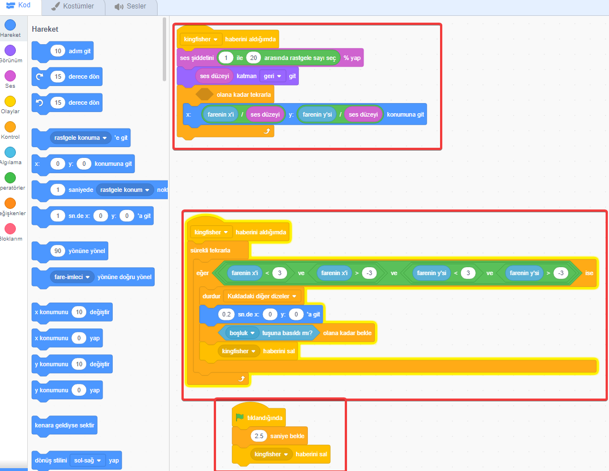

# Scratch Tanıtım

## Giriş

1. [scratch.mit.edu](https://scratch.mit.edu/) sitesine girerek doğrudan tarayıcıdan kullanılır.
2. Geniş bir sahne, karakter ve ses kolleksiyonu vardır.
3. Yapılan programlara internet üzerinden ulaşabileceğiniz gibi bilgisayarınıza da kaydetmek mümkündür.
4. Kendi içinde eğitim videoları da vardır.
5. Orjinal program İngilizce olmasına rağmen **Türkçe'si** de vardır.
6. Versiyon 3 robot sistemlerini de destekler.

### Hesap oluşturma

Scratch kullanmak için hiç bir ön bilgisayar bilgisi gerekmez. Yaklaşık 5-10 dk içinde bir ücretsiz scratch hesabı oluşturabilirsiniz. 

Scratch bir e-posta adresi gerektirir.

### Kuklalar

Etrafta dolaşan başka nesnelerle ilişkide bulunan nesnelere kukla denir. Bir hayvan, insan , meyve , roket gibi herhangi bir resim olabilir. Bu işlemleri kodlarla  yapar.

### Kodlama

Mousela sürükleyip bırakabileceğiniz bloklardan oluşur.

