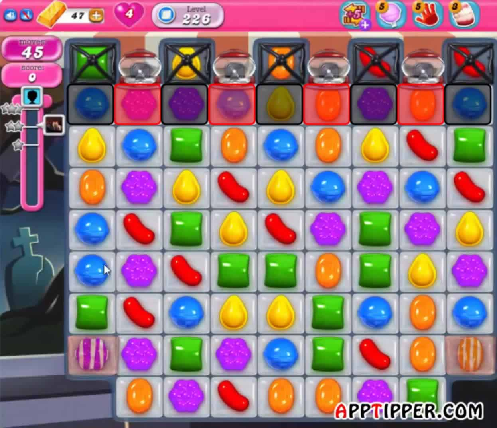

# Bilgisayar Oyunları

## İyi Oyun Nasıl Olur?

**Bazı oyunları** oyuncular tekrar ve tekrar oynamak ister. İşte böyle oyunlar geliştirmek için öncelikle oyunlar hangi elemanlardan oluşuyor onu düşünüp, bunların nasıl bir araya geleceğini öğrenmeliyiz.

### Atmosfer

### Tasarım

Bu bölümde kısaca windows içinde bulunan Paint 3D kullanarak karakter tasarımı anlatılacak.



Bir hayvan , Prenses , Yarış arabası hatta bir baloncuk bile olabilir.




Mekanik oyundaki "fiilerdir"



### Ses

**Kim sessiz oyun oynamak isterki?**

\*\*\*\*

#### Müzik

#### Ses efektleri

#### Kod

### Oyun Tasarımı

İyi pazarlama müzik yada tasarım bile kötü bir oyun tasarımını düzeltemez.

