# Bilgisayar Oyunları

## OYUN TÜRLERİ

Neredeyse bütün oyunlar belli başlı ANA KATEGORİLERE dahildirler.

### Masa oyunları

Satranç yada yapboz gibi oyunlar. Yüzyıllardır insanların beğendiği bir gurup oyundur.

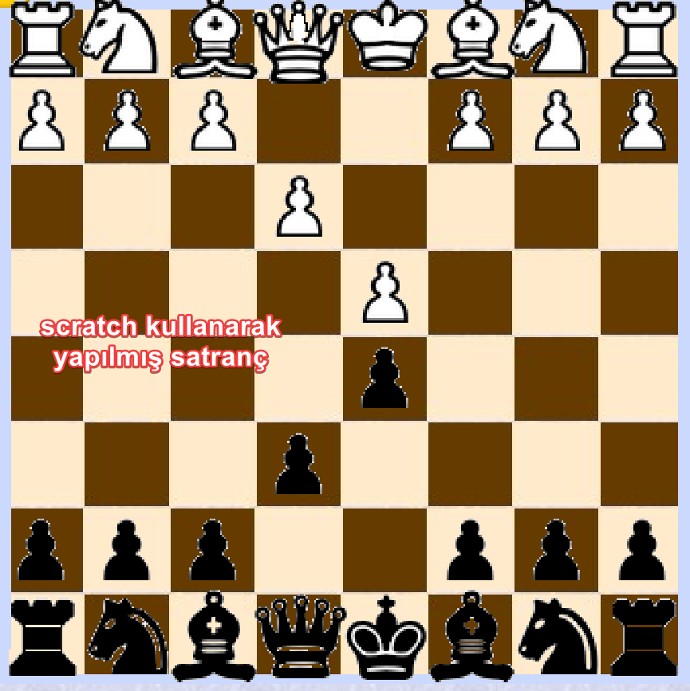

### Yarış Spor

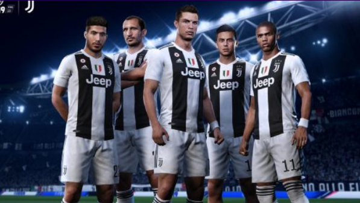

### Rol oynama

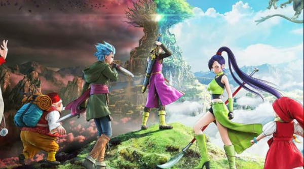

### Savaş

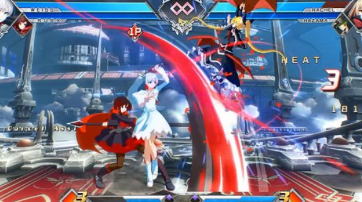

### Strateji

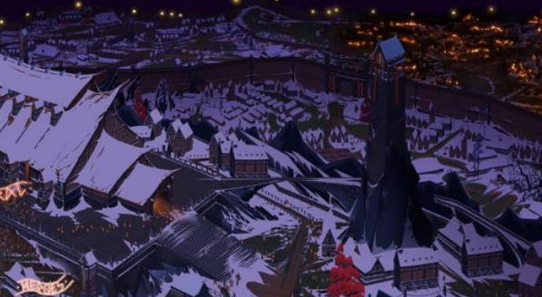

### Çok oyunculu

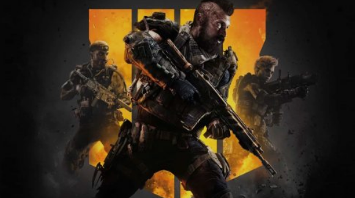

### Müzik Dance

Sanal bir enstruman çalınıyor

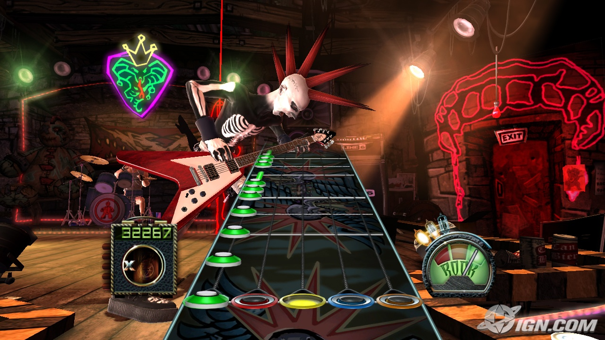

## İyi Oyun Nasıl Olur?

**Bazı oyunları** oyuncular tekrar ve tekrar oynamak ister. İşte böyle oyunlar geliştirmek için öncelikle oyunlar hangi elemanlardan oluşuyor onu düşünüp, bunların nasıl bir araya geleceğini öğrenmeliyiz.

### Atmosfer

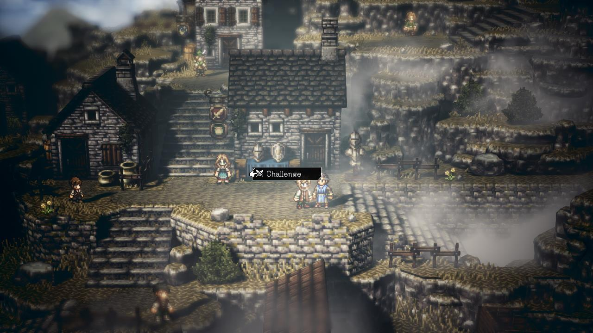

#### Hikaye

Oyun sahnesinin hazırlanabilmesi ve oyuncuların yapacaklarına bir anlam verebilmeleri için oyunların hikayeleri olmalıdır.

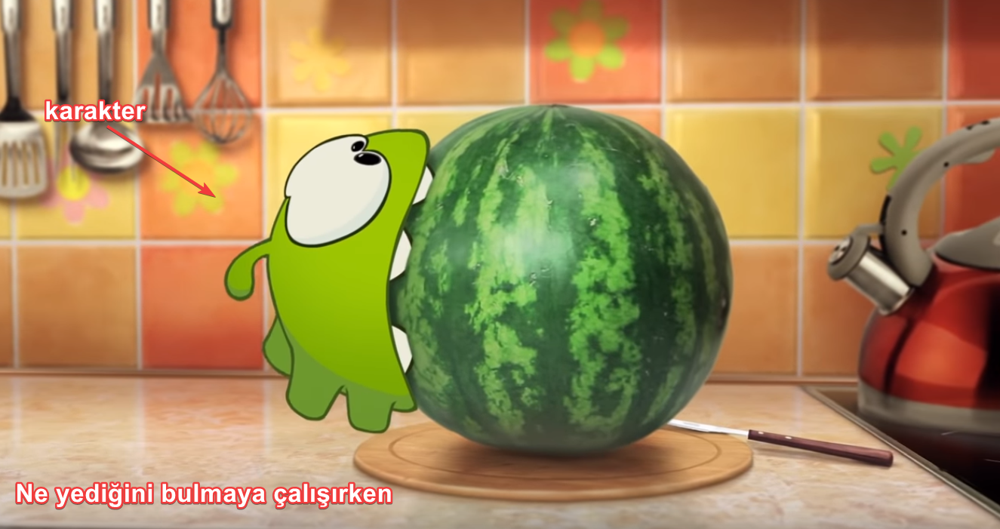

#### Hız

Oyun hızı oyuncunun heyecanını etkiler

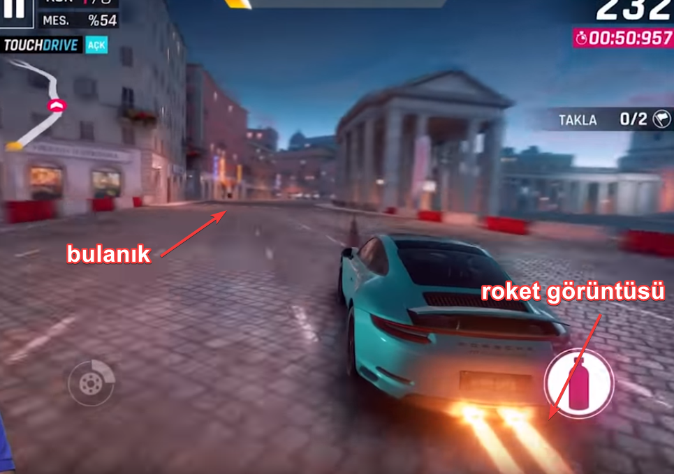

#### Renk Paleti

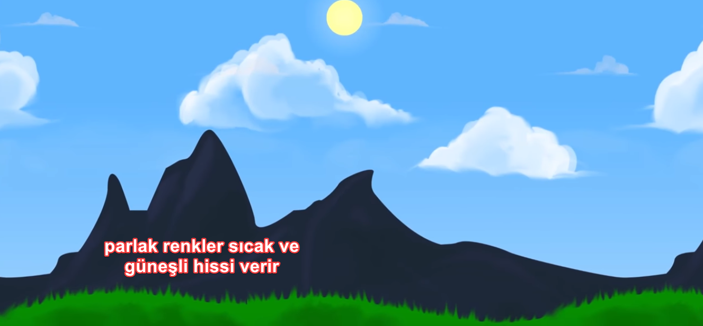

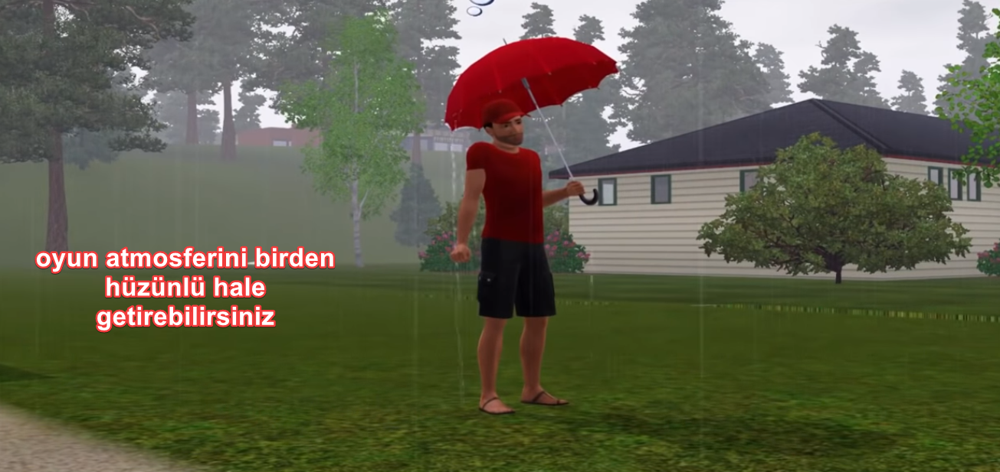

#### Mekan

Atmosfer oluşturmanın en kolay yollarından birisi elbette hikayenin geçtiği yeri seçmektir.

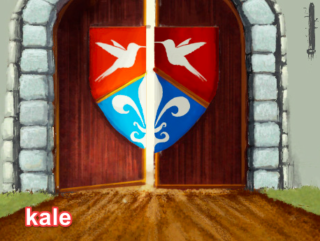

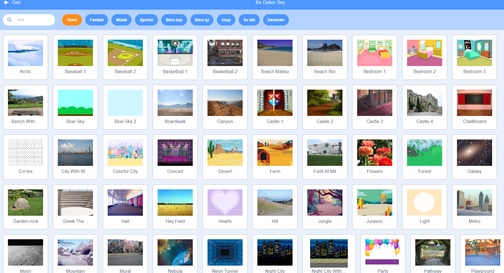

### Tasarım

Bu bölümde kısaca windows içinde bulunan _Paint 3D_ kullanarak karakter tasarımı anlatılacak.

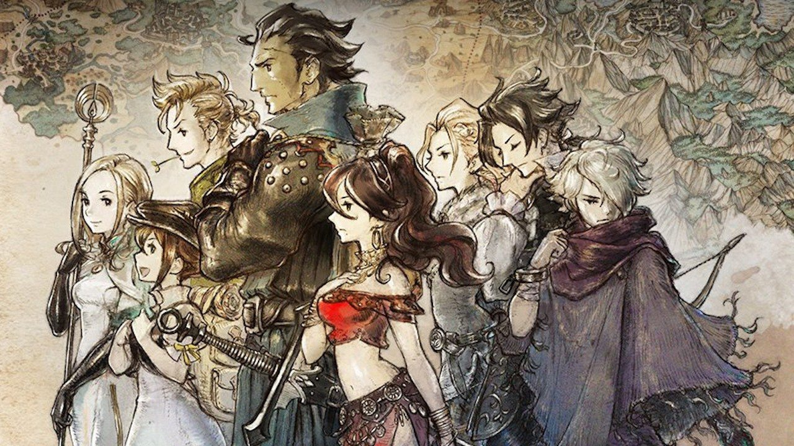

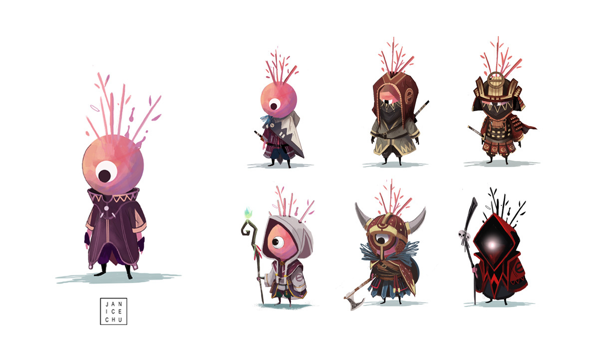



Karakterler ; 

* Bir hayvan 
* Prenses 
* Yarış arabası 
* hatta bir baloncuk bile olabilir.

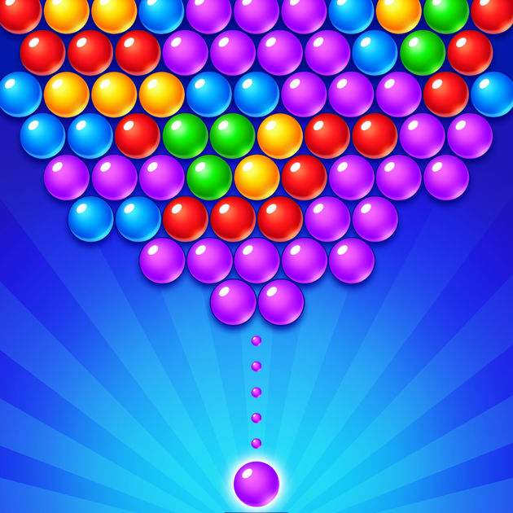



Mekanik oyundaki **eylem**lerdir. Yani 

* Zıplama
* Uçma
* Bir nesneyi tutma
* Büyü yapma
* Silah kullanma

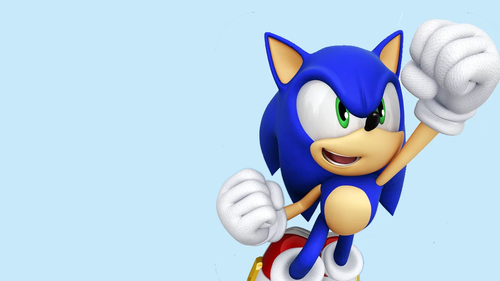



Ne yapıp yapamayacağını söyleyen kurallar. Örneğin karakterin nasıl ve neleri yapabiliyor, duvarlardan geçebiliyor musun yada uçabiliyor musun?

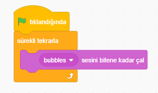



Her oyunda mutlaka bir meydan okuma olmalı, başarılması gereken hedefler oyunları oynama isteği oluşturur. 

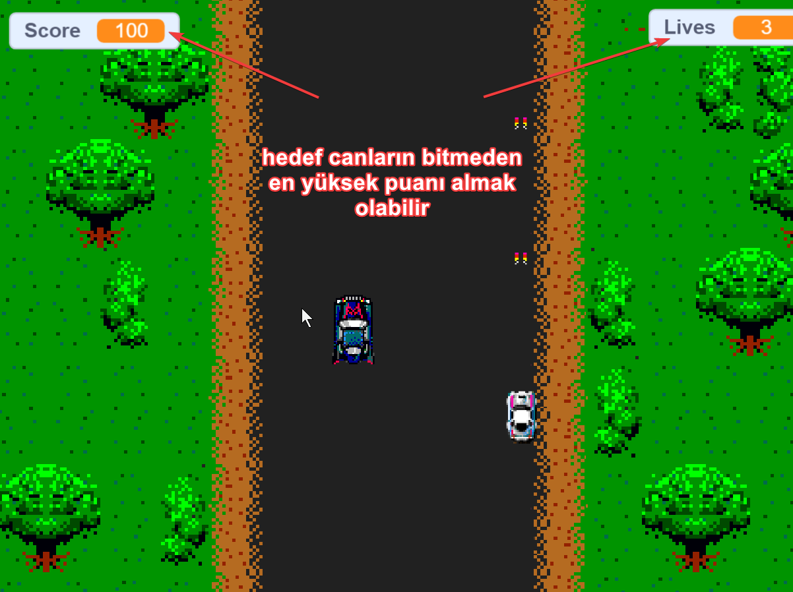



Klavye, mouse, joystick ve haraket sensörleri.



Oyunun geçtiği sahne detaylarını da tasarım anında düşünmek gerekir.

Dünya oyuncuyu sınırlayacak duvarlara sahip mi? Mevsimler var mı?



### Ses

**Kim sessiz oyun oynamak isterki?**

Oyunları çekici yapan en önemli unsurlardan biri de oyundaki seslerdir.

#### Müzik

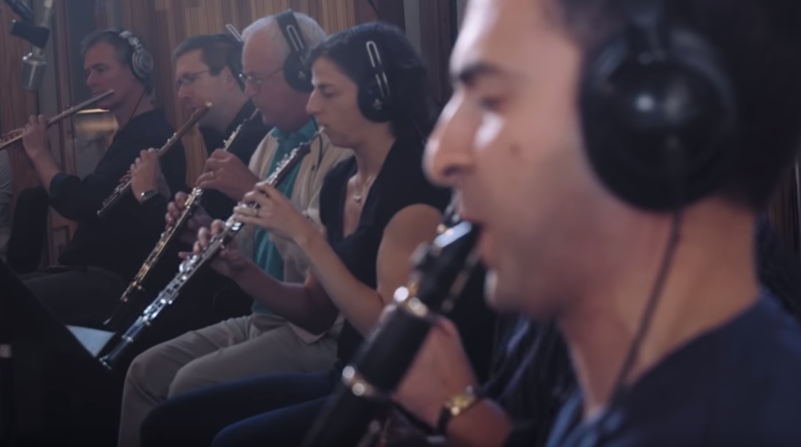

#### Ses efektleri

### Kod

Güzel bir oyun sorunsuz çalışan bir kod gerektirir.

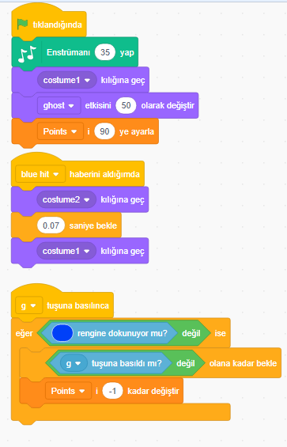

### Oyun Tasarımı

İyi pazarlama müzik yada tasarım bile kötü bir oyun tasarımını düzeltemez.

## Kodlar ne işe yarıyor

Bilgisayarlar henüz kendi başlarına düşünemiyor. Sadece programcıların kendilerine verdiği komutları yaparlar. Bilgisayarların anlayacağı dilde komutlar yazmayı öğreneceğiz.

Diyelimki bir tavuğun tilkiye yakalanmadan dereden akan mısırları yemeye çalıştığı bir oyun yazmak istiyorsunuz.  Bu durumda 3 nesne için ayrı kod yazmanız gerekiyor.

1. Tavuk için
2. Tilki için kod
3. Mısırlar için kod

**Tavuk için Kod**

1. [ ] Ekranın sol altında görün
2. [ ] Aşağıdaki görevleri tekrarla
   1. [ ] Eğer oyuncu sol tuşa basarsa..
      1. [ ] Eğer gidebiliyorsan biraz sola git
   2. [ ] Eğer oyuncu sağ tuşa basarsa...
      1. [ ] Eğer gidebiliyorsan biraz sağa git
   3. [ ] Eğer oyuncu boşluk tuşuna basarsa
      1. [ ] Mısırlara doğru git

**Tilki için Kod**

* [ ] Ekranın ortasında görün
* [ ] Aşağıdaki görevleri tekrarla
  * [ ] Eğer tavuk sağımdaysa
    * [ ] biraz sağa git
  * [ ] Eğer Tavuk Solumdaysa
    * [ ] biraz sola git
  * [ ] Eğer tavuk bana dokunursa 
    * [ ] oyunu durdur

**Mısırlar için Kod**

* [ ] Ekranın üstünde görün
* [ ] Aşağıdaki görevleri tekrarla
  * [ ] biraz aşağı ilerle
  * [ ] biraz sağa ilerle
  * [ ] Eğer ekranın sonuna gelirsen
    * [ ] ekrandan kaybol
    * [ ] başladığın yerde tekrar görün
  * [ ] Eğer Tavuk dokunursa
    * [ ] oyun puan tablosuna bir puan ekle
    * [ ] ekrandan kaybol
    * [ ] başladığın yerde tekrar görün

### **Programlama Dilleri**

**Bu sayfadaki kodlar basit türkçe diliyle yazıldı böyle konuşma diliyle yazılan kodlara PSEUDO CODE denir.** 

PSEUDO CODE bilgisayarların anlayabileceği değil insanların anlayabileceği bir dildir.

Bigisayarların anlayabileceği bir dile çevrilmesi gerekir. Bu kitapta Scratch kodlama dilini kullanacağız.

Scratch kodlamayı öğrenmek için geliştirilmiştir.

